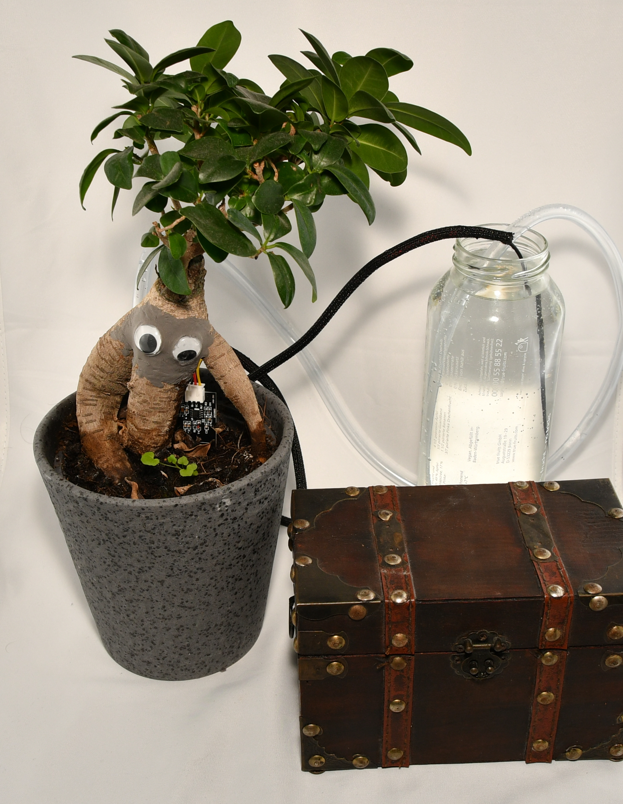
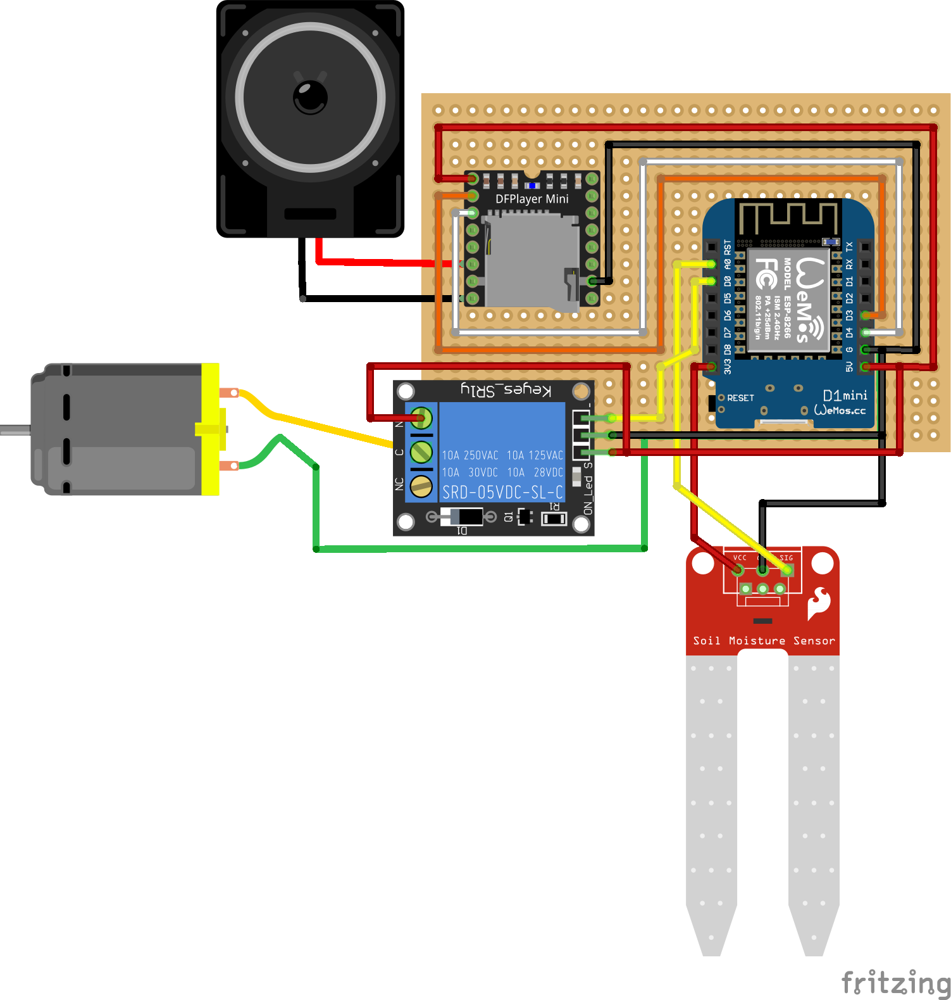

# Alraune mit Bewässerung (Work in Progress)

Dieses Repository enthält den Quellcode für einen D1 Mini, die Assets und Informationen für Bau einer schreienden Alraune mit Wasserpumpe.

Das Repository ist noch nicht ganz fertig.



## Funktionen

- Automatisches Wässern, wenn die Alraune trocken wird
- Akkustiche Erinnerung mit verschiedenen Sprüchen, den Wasserbehälter der Pumpe nachzufüllen
- Übermittlung statistischer Daten inkl. Feuchtigkeit der Erde an einen konfigurierbaren Logstashserver (Eigener ELK Stack benötigt)
  - Dashboard mit aktuellen Werten und zeitlichem Verlauf
  - Alarmfunktion über Kibana
- Setup Funktion
  - Aufspannen eines Access Points mit WLAN alraune und Passwort
  - Bereitstellen einer Setupseite unter http://alraune.local im alraune WLAN
  - Konfiguration von SSID und WLAN Passwort und Name der Alraune
  - Ladebildschirm
  - Automatische Weiterleitung zur Statusseite, wenn das Setup erfolgreich war
- Statusseite unter http://alraune.local im konfigurierten WLAN
  - Alraune zum Kitzeln
  - Statusinformationen zu Feuchtigkeit und ob die Alraune Wasser braucht oder der Container aufgefüllt werden muss
  - Möglichkeit den Sensor neu zu kalibrieren
  - Einstellung der Lautstärke der Sounds
  - Abspielen der Sounds für Demozwecke
- Konfigurierbare automatische Upgrades (Funktionen müssen auf eigenem Server implementiert sein)
  - Installation neuer signierter Versionen der Firmware
  - Aktualisierung der Dateien des Dateisystems
  - Löschen nicht mehr benötigter Dateien

## Anleitung

Eine detaillierte Anleitung wird in mehreren Beiträgen auf meinem Blog seism0saurus.de erscheinen:
 - [Teil 1 - Überblick](https://seism0saurus.de/posts/alraune/)

### Komponenten verbauen

Die Schaltung habe ich nachträglich mit [Fritzing](https://fritzing.org/) visualisiert. Das OpenSource Tool kann man gegen eine Gebühr herunterladen oder selbst kompilieren und bietet einen visuelleren Zugang als reine Schaltpläne. Bei größeren Installationen wird es aber unübersichtlich.

Bitte prüft vor dem Bau, ob die abgebildete Schaltung für eure Auswahl an Komponenten korrekt ist und holt euch gegebenenfalls jemand mit Erfahrung zur Unterstützung. Ich übernehme keine Garantie für einen gefahrlosen Betrieb auf Basis dieser Repositories oder der Blogbeiträge.



### IDE intallieren und einrichten

Das Projekt habe ich in der Arduino IDE entwickelt. Vermutlich läuft es auch in anderen IDEs, aber ich nutzte z.b. die Funktion zum Signieren von Upgrades.

#### IDE installieren

Lade die IDE einfach von der [Projektseite](https://www.arduino.cc/en/software) herunterladen. Es gibt sie für Windows, Linux und MacOS.

#### ESP8266 Library installieren

Da sich im [Arduino](https://github.com/esp8266/Arduino/) Code des ESP8266 Projekts ein [Bug](https://github.com/esp8266/Arduino/issues/8707) bei der Prüfung der Signaturen beim Upgrade eingeschlichen hatte, muss momentan die Bibliothek aus dem master Branch genutzt werden. Dort ist ein [Pull Request](https://github.com/esp8266/Arduino/pull/8709) von mir gemerged worden.

Nach dem nächsten Release kann die normale Releaseversion über den Boardmanager installiert werden.

Die Installation ist in einzelnen Schritten in der [Dokumentation](https://arduino-esp8266.readthedocs.io/en/latest/installing.html#using-git-version) des Projekts nachzulesen.

### Schlüsselpaar erstellen

Aus dem entsprechenden [Abschnitt der Dokumentation](https://arduino-esp8266.readthedocs.io/en/latest/ota_updates/readme.html#signed-binary-prerequisites) des ESP8266 Projekts ist zu entnehmen, dass 2048 Bit lange RSA Schlüssel für die Signatur der Upgrades genutzt werden können.

Bei einem Upgrade prüft der Controller dann mit dem öffentlichen Schlüssel, ob die geladene Datei vom privaten Schlüssel signiert wurde. So ist sichergestellt, dass keine gefälschten Upgrades installiert werden.

Unter Linux kann ein passendes Schlüsselpaar im Ordner [Alraune](./Alraune/) wie folgt angelegt werden.

```bash
cd /path/to/repo/Alraune
openssl genrsa -out private.key 2048
openssl rsa -in private.key -outform PEM -pubout -out public.key
```

#### Automatisches Signieren

Solange das Schlüsselpaar in dem Ordner liegt und man richtiges Betriebsystem (Linux, MacOS) nutzt, wird die Arduino IDE [Autosigning](https://arduino-esp8266.readthedocs.io/en/latest/ota_updates/readme.html#automatic-signing-only-available-on-linux-and-mac) aktivieren.

Damit automatisch die signierte Version exportiert wird, kann die `platform.txt` des ESP8266 überschrieben werden.
Dazu muss die Datei [platform.local.txt](./platform.local.txt) in den Ordner der Library `esp8266` kopiert werden.

Wenn wie hier die Library über git installiert wurde, sollte folgender Befehl ausreichen.
```bash
cd /path/to/repo/
cp platform.local.txt ~/Arduino/hardware/esp8266com/esp8266/
```

Dadurch wird beim Export der Binärdatei in der Arduino IDE über `Sketch -> Kompilierte Binärdatei Exportieren` die signierte Datei exportiert und nicht die unsignierte.

#### Manuelles Signieren

Unter Windows muss man die kompilierten Upgrades manuell signieren. Für die Prüfung muss der Publik Key mit in den [data](./data/) Ordner abgelegt werden.

Danach muss in der [Alraune.ino](./Alraune/Alraune.ino?plain=1#L72) Datei die Variable `MANUAL_SIGNING` auf 1 gesetzt werden.

```c
#define MANUAL_SIGNING 1
```
Dadurch wird automatisch der `public.key` vom Filesystem des D1 Mini geladen und zur Prüfung der Upgradedateien genutzt.

Dieser Prozess wird auch in der [Dokumentation](https://arduino-esp8266.readthedocs.io/en/latest/ota_updates/readme.html#manual-signing-of-binaries) des ESP8266 Projekts beschrieben.

### Konfiguration anpassen

In der [config.json](./data/config.json) müssen die Parameter für den Upgradeserver und den Logstashserver gesetzt werden.

Außerdem sollte die Uhrzeit eingestellt werden, wann die Alraune schreien soll. Standardmäßig schreit sie von stündlich von 8 - 22 Uhr.

Den Namen der Alraune, den Geburtstag und die Zugangsdaten zum WLAN werden während des Setups erfasst und müssen nicht gesetzt werden.

### Filesystem vorbereiten

Es gibt ein Plugin für die Arduino IDE, mit der Dateien auf das Filesystem des D1 Mini übertragen werden können.

#### Plugin installieren

Zunächst muss das Plugin von der [Projektseite](https://github.com/earlephilhower/arduino-esp8266littlefs-plugin/releases) heruntergeladen werden. Danach ist die Installation wie im [ESP8266 Projekt](https://arduino-esp8266.readthedocs.io/en/latest/filesystem.html#uploading-files-to-file-system) beschrieben.

#### Dateien zippen und kopieren

Damit die Dateien für den Webserver weniger Platz verbrauchen, habe ich ein kleines [Skript](./import_data.sh) geschrieben, dass die statischen Dateien mit gzip komprimiert. Es kopiert die Dateien aus dem [data](./data/) Ordner des Repositories in den [data](./Alraune/data) des Arduino Projekts.

Das Skript kann einfach in der Konsole unter Linux ausgeführt werden.
```bash
cd /path/to/repo/
./import_data.sh
```

#### Dateien hochladen

Der D1 Mini muss über USB mit dem Rechner verbunden sein und es darf **kein** Serieller Monitor geöffnet sein.

Wenn alle Dateien im Ordner [data](./Alraune/data) des Arduino Projekts liegen, können sie über das Menü `Werkzeuge -> ESP8266 LittleFS Data Upload` auf den D1 Mini hochgeladen werden.

### MicroSD Karte vorbereiten

Den Inhalt des Ordners [sd_card](./sd_card/) muss in der richtigen Reihenfolge auf eine MicroSD Karte kopiert werden, da der DFPlayer Mini nicht die Dateinamen, sondern die Reihenfolge der Erstellung beachtet.

Daher sollte die Karte frisch mit FAT32 formatiert werden und dann mit dem Dateiexplorer unter Windows oder mit rsync unter Linux kopiert werden.
Danach sollten sich auf der Karte nur die Ordner 01-03 befinden.

### Code kompilieren

In der Arduino IDE auf `Sketch -> Überprüfen/Kompilieren` klicken.

### Logstash konfigurieren

TBD

### Upgradeserver konfigurieren

TBD

### Flashen

Der D1 Mini muss über USB mit dem Rechner verbunden sein.

In der Arduino IDE auf `Sketch -> Hochladen` klicken.

### Upgrades

In der Arduino IDE auf `Sketch -> Kompilierte Binärdatei Exportieren` klicken.

Bei manuellen signieren die Datei anschließen signieren.

Falls der Upgrade Server so konfiguriert ist wie meiner (Anleitung folgt), kann das Skript [import_data.sh](./import_data.sh) genutzt werden. Hierfür ist ein konfigurierter SSH Zugang zum Upgradeserver nötig.

Dann sollten zunächst die aktuellen Daten kopiert werden und danach das Skript  in der Konsole unter Angabe einer neuen Versionsnummer unter Linux ausgeführt werden.
```bash
cd /path/to/repo/
./import_data.sh
./import_data.sh 0.9.11
```

Es wählt sich über ssh auf dem Upgradeserver ein, legt im Homerverzeichnis unter `esp-update-server/projects/alraune` einen neuen Ordner für die angegebene Versionsnummer an und kopiert die neue Firmware und die Daten aus dem Ordner [data](./Alraune/data) des Arduino Projekts.

Die Alraune prüft automatisch nach einigen Minuten nach neuen Updates und lädt diese herunter, wenn die Versionsnummer größer ist, als die aktuell eingesetzte.

## Feedback

Gerne könnt ihr hier auf GitHub Fehler melden oder Verbesserungen einreichen. Auch sonstiges konstruktives Feedback ist mit sehr Willkommen. Dies ist mein erstes richtiges IoT Projekt und ich lerne gerne dazu.
